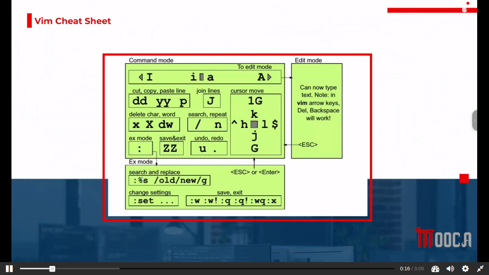

# Red Hat System Administration - I

## CH03_Managing Files From the Command
### CH03_VID14_Pattern Matching

### CH03_VID15_Grep Command

### CH03_VID16_Using Regular Expressions with Grep

## CH05_Creating, Viewing, and Editing Text Files
### CH05_VID06_VIM Cheat Sheet

